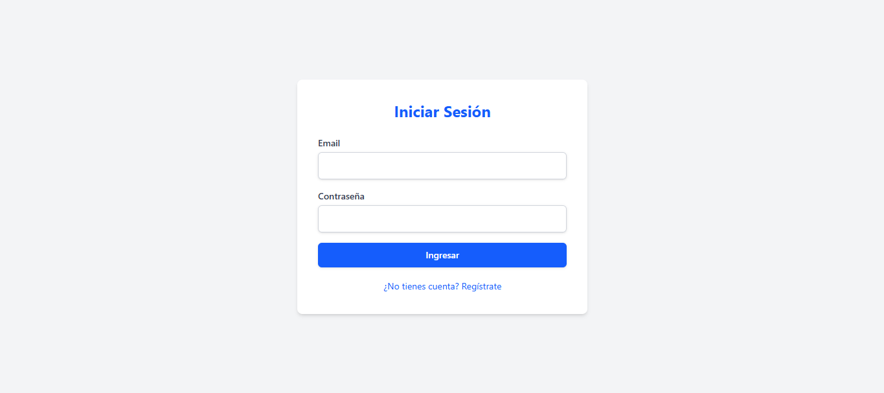

## 🔐 **FastAPI Authentication System**
*Sistema de autenticación JWT con roles*

_Login:_ 

---

### 🚀 **Características principales**
- Autenticación JWT segura
- Registro y login de usuarios
- Protección de endpoints
- Interfaz web con Jinja2 + Tailwind CSS
- Sistema de roles básico (admin/user)
- 100% listo para producción

---

### ⚙️ **Configuración rápida**
1. Clonar repositorio
    ```bash
    git clone https://github.com/tu-usuario/fastapi-jwt-auth.git
    cd fastapi-jwt-auth
    ```

2. Configurar entorno
    ```bash
    python -m venv venv
    source venv/bin/activate  # Linux/Mac
    venv\Scripts\activate    # Windows
    ```

3. Instalar dependencias
    ```bash
    pip install -r requirements.txt
    ```

4. Configurar variables
    ```bash
    cp .env.dist .env
    # Editar .env con tus valores
    ```

5. Ejecutar
    ```bash
    uvicorn app.main:app --reload
    ```

---

### 📂 **Estructura de archivos**
```text
fastapi-jwt-auth/
├── app/
│   ├── templates/      # Vistas Jinja2
│   ├── static/         # CSS/JS
│   ├── database.py     # Config SQLAlchemy
│   ├── dependencies.py # Lógica de autenticación
│   └── ...
├── tests/              # Pruebas automatizadas
├── .env.dist          # Plantilla variables de entorno
└── requirements.txt   # Dependencias
```

---

### 🌟 **Tecnologías utilizadas**
- **Backend**: FastAPI, Python 3.12
- **Autenticación**: JWT, OAuth2
- **Base de datos**: SQLite (PostgreSQL ready)
- **Frontend**: Jinja2 + Tailwind CSS
- **Testing**: Pytest

---

### **Datos de Prueba**
#### **Usuario Admin**
Para crear un usuario admin, lanza el srvidor, y en una pestaña adicional ejecuta manualmente:
```bash
curl -X POST "http://localhost:8000/auth/signup" \
-H "Content-Type: application/x-www-form-urlencoded" \
-d "email=admin@example.com&password=secret123&role=admin"
```

#### **Creara las siguientes credenciales**:
- **Usuario**: admin@example.com
- **Password**: secret123


---

### 🖥️ **Uso básico**  
#### **Endpoints clave**  
| Método | Endpoint       | Descripción                |
|--------|---------------|----------------------------|
| POST   | /auth/signup  | Registro de usuarios       |
| POST   | /auth/login   | Inicio de sesión           |
| GET    | /welcome      | Área privada (requiere auth)|

#### **Interfaz web**  
- `/`: Página de login  
- `/signup`: Formulario de registro  
- `/welcome`: Dashboard post-login  

---

### 🛠️ **Próximas mejoras**  
- [ ] Integración con PostgreSQL  
- [ ] Sistema de roles avanzado  
- [ ] Recuperación de contraseña  
- [ ] Logging profesional  
- [ ] Dockerización  

---

### 🤝 **Contribuciones**  
¡Se aceptan contribuciones! Por favor:  
1. Haz fork del proyecto  
2. Crea tu rama (`git checkout -b feature/nueva-funcionalidad`)  
3. Haz commit de tus cambios  
4. Push a la rama  
5. Abre un Pull Request  

---

### 📜 **Licencia**  
MIT License - Ver [LICENSE](LICENSE) para más detalles.

---

> ✨ **Nota**: Este proyecto busca demostrar buenas prácticas en el desarrollo de APIs seguras con FastAPI. Ideal para portafolios técnicos.